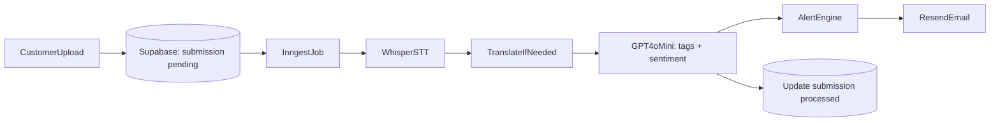

# ADR-003: Async Processing Pipeline

| | |
|---|---|
| **Status** | Accepted |
| **Date** | 2026-06-11 |

## Decision

Inngest — managed async job orchestration (no self-managed Redis for MVP).

## Rationale (MVP)

Customer gets instant "Thank you" (<1s). Whisper + GPT take 5–15s — must not block capture UX. Inngest provides durable retries without operating Redis.

## Pipeline steps

## Revisit when

Job volume exceeds Inngest free tier, you need sub-second alert SLA guarantees, or you want full control over queue semantics.

## Future options

BullMQ + Upstash Redis (or self-hosted Redis) for queue as source of truth; dead-letter queues; idempotency keys per submission; step-level observability (Datadog/Sentry).

## Fault tolerance gaps

No explicit dead-letter handling documented yet. No idempotency on Whisper/GPT calls (duplicate processing on retry). No fallback if OpenAI API is down (queue backs up, no degraded mode).
